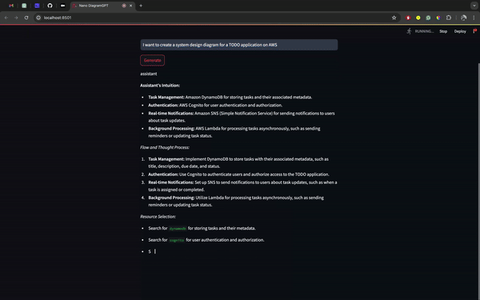

# Local-DiagramGPT

A local **DiagramGPT** which works on a narrow use case of generating system architecture diagrams using AWS services.

## Setup

Please follow the following steps to run this locally on your machine.

### Clone the Repo

```sh
git clone https://github.com/vatsalsaglani/local-diagramgpt.git
```

### Install dependencies

```sh
pip install -r requirements.txt --no-cache-dir
```

### Create a `model` folder

Create a model folder inside the `local-cpp-search` folder so that we can download the model in that folder.

```sh
mkdir model
```

### Download the model

[Download the quantized Llama-3-8B-Instruct model in GGUF format from HuggingFace](https://huggingface.co/QuantFactory/Meta-Llama-3-8B-Instruct-GGUF/tree/main).

> Remember to move the model to the `model` folder.

### Enable Static File Serving in Streamlit

To enable static file service follow these steps,
1. Create a .streamlit folder.
2. Add configs.toml with the following content in that folder

```toml
[server]
enableStaticServing = true
```

### Start the Streamlit app

```sh
streamlit run app.py
```

## Demo

Let's look at a real-time demo.

**_User Description_**: Create a system architecture diagram for  TODO Application

